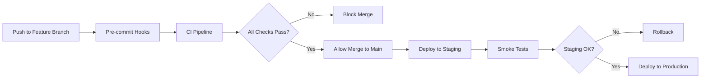

# Branch Protection and Quality Gates

## Required Status Checks

Configure these in GitHub Settings > Branches > Branch protection rules for `main`:

### ✅ Required Checks (All must pass):
- `Code Quality & Security`
- `Run Tests (Node 18)`  
- `Run Tests (Node 20)`
- `Run Tests (Node 22)`
- `Docker Integration`
- `Security Scan`

### 🔧 Repository Settings:
- ✅ Require pull request reviews before merging (2 reviewers)
- ✅ Dismiss stale PR reviews when new commits are pushed
- ✅ Require review from CODEOWNERS
- ✅ Require status checks to pass before merging
- ✅ Require branches to be up to date before merging
- ✅ Require conversation resolution before merging
- ✅ Include administrators in restrictions

## Quality Gates

### 📊 Coverage Requirements:
```json
{
  "coverageThreshold": {
    "global": {
      "branches": 70,
      "functions": 70,
      "lines": 70,
      "statements": 70
    }
  }
}
```

### 🚨 Blocking Conditions:
1. **Test Failures**: Any failing unit/integration/E2E tests
2. **Security Issues**: High/critical vulnerabilities in dependencies
3. **Coverage Regression**: Coverage drops below thresholds
4. **Docker Build Failures**: Container build or test failures
5. **Performance Regression**: Load tests show >20% performance degradation
6. **Merge Conflicts**: Unresolved conflicts with target branch

### ⚡ Fast Feedback Rules:
- **Unit tests**: Must complete in < 2 minutes
- **Integration tests**: Must complete in < 5 minutes  
- **E2E tests**: Must complete in < 10 minutes
- **Docker tests**: Must complete in < 15 minutes

## Deployment Pipeline



## Breaking Change Detection

### Automated Detection:
- API endpoint changes (OpenAPI diff)
- Configuration schema changes
- Environment variable changes
- Docker image breaking changes
- Database migration requirements

### Manual Review Required:
- Major dependency updates
- Architecture changes
- Security model changes
- Performance critical changes